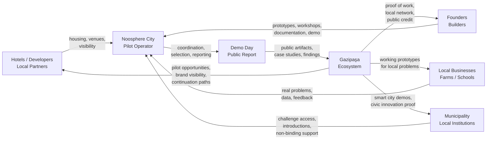

# Ecosystem Value Exchange

**Status: proposed / draft.**

This document visualizes the fair exchange of value between all participants in the Noosphere City Gazipaşa pilot.

---

## The fair exchange principle

Noosphere City should proceed only if every participant can clearly answer:

- **What do I contribute?**
- **What do I receive?**
- **Why is this fair?**

Housing support, local challenges, founder work, public visibility, prototypes, and partner access are not charity or extraction. They form a transparent exchange where all sides benefit. No participant should be treated as a resource without a return of value.

---

## Ecosystem diagram

---

## Participant exchange map

### Hotels / apart-hotels / developers

| They give | They receive |
|---|---|
| Temporary housing or venue (30–90 days) | Prototype tailored to their context |
| Visibility as innovation host | International press and demo-day credit |
| Local introductions | Pilot-partner positioning |

### Municipality / local institutions

| They give | They receive |
|---|---|
| Challenge access and introductions | Smart city / civic tech prototypes |
| Non-binding support letter (optional) | Public report and demo day |
| Legitimacy signal | Proof of concept for future programs |

### Local businesses / farms / schools

| They give | They receive |
|---|---|
| Real problem and data access | Working prototype at no cost |
| Testing and feedback time | Priority access for continued development |
| Challenge context | Public acknowledgment as challenge owner |

### Founders / builders

| They give | They receive |
|---|---|
| Working prototype | Housing support (subject to partner agreement) |
| Public workshop | Real local challenge and data access |
| Documentation and open code | Demo day and public report credit |
| Demo day delivery | Community and local network |

### Noosphere City operator

| They give | They receive |
|---|---|
| Program coordination and selection | Proof-of-concept for the residency model |
| Reporting and transparency | Case studies and continuation opportunities |
| Partner facilitation | Data on what works and what does not |

---

## Exchange is conditional

The exchange is only fair if:

1. Founders deliver working prototypes at demo day, not slide decks.
2. Partners provide real housing or venues — not "in principle" commitments.
3. Challenge owners engage actively, not nominally.
4. The public report is honest, including failures.
5. No participant receives less than they were promised in writing.

If any of these conditions fail, the exchange is unbalanced. The pilot should pause and the failure should be documented before a new cohort is launched.

---

## Related documents

- [docs/value_exchange_principle.md](value_exchange_principle.md)
- [docs/residency_for_impact_model.md](residency_for_impact_model.md)
- [docs/stakeholder_map.md](stakeholder_map.md)
- [metrics/README.md](../metrics/README.md)
